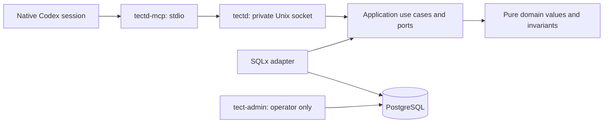

# tectd — Tect V2.1 foundation

A Rust daemon with PostgreSQL as the canonical store. A workspace is a logical
database object. Its identity comes from an authenticated tenant and an explicit
workspace key; it has no workspace directory or workspace Git worktree.

This repository implements workspace bootstrap, Program formation, reviewed Scope
candidate planning, native Scope/Slice execution, initial workspace instructions,
and bounded Durable Knowledge in V2.1. The installed Tect plugin and persistent
runtime are separate from this source checkout; using or updating them is an
explicit task decision.

The native session MCP bridge opens logical workspaces, registers Git sources and
selects worktrees per session. `get_state` does not create or update records and
never reads files or runs Git. Bootstrap and selection changes are atomic. Recovery, revocation
and measured performance acceptance are included in the final vertical of this Scope.

## Architecture



`tect-domain` and `tect-application` cannot depend on persistence or host adapters.
The application owns authorization order and transaction boundaries. SQLx stays in
`tect-postgres`; environment, files, processes and protocol stay in `tect-host`.
The composition binaries wire them together. Run `scripts/check-architecture.py`
to enforce the dependency allowlist, inner-crate I/O boundary and 500-line limit
for production or mixed Rust files and all SQL files. Rust files proven reachable
only from integration tests or `#[cfg(test)]` modules are exempt from that limit.

## Local configuration

Build with Rust 1.93.0 (`rust-toolchain.toml`), SQLx 0.8.6 and PostgreSQL 18.6.
Create a dedicated database and a separate login role with `NOSUPERUSER`,
`NOBYPASSRLS` and no schema ownership. The migration command grants that role only
its required table/function privileges. The daemon refuses an owner or superuser
connection. Keep admin and runtime connection URLs outside source control.

The operator runs `tect-admin migrate --runtime-role ROLE` with
`TECT_ADMIN_DATABASE_URL`, then `tect-admin enroll --out /absolute/private/host.json`.
Migration 0009 installs durable-knowledge metadata only. To activate the pinned native
pgRDF 0.6.34 capability explicitly, the database operator runs
`tect-admin migrate --runtime-role ROLE --enable-durable-knowledge`. This flag creates
or verifies the extension, installs the pinned shapes and private adapter contract,
and marks workspace capability ready. MCP routes never activate the extension.
Enrollment creates a tenant and owner, or uses an explicitly supplied existing
`--tenant UUID`. Repeated `--source-root /absolute/path` arguments declare the host's
allowed repository locations; an empty list permits zero-source bootstrap.
Repeated `--setup-root /absolute/path` arguments independently grant initial AGENTS.md
publication under those physical directories. Source roots do not grant file writes.
For an existing host, `tect-admin grant-setup-root --host-id UUID --setup-root /absolute/path`
adds one canonical root without changing its identity, credential or source roots.
Concurrent additions preserve both roots; repeating an existing grant is harmless.
The generated host credential file must remain private and must not be printed.
For an externally assigned tenant and host identity, operators can instead run
`tect-admin ensure-tenant --tenant UUID`, followed by
`tect-admin register-host --tenant UUID --auth-file /absolute/private/host.json`
with the repeated source/setup root arguments above. These commands are atomic and
idempotent. Registration verifies an existing host exactly and rejects changed,
duplicate, or revoked identity instead of rotating or restoring it.

For a distinct verifier identity, the operator can run
`tect-admin enroll-verifier --tenant UUID --workspace UUID --out /absolute/private/verifier.json`.
The workspace must already belong to that tenant. The command creates a new verifier
principal, host credential, and membership only for that workspace. Verifier session
opening is disabled until its separate workflow is implemented; this credential does
not grant owner commands. The output file follows the same private-file rules as owner
enrollment.

If PostgreSQL does not acknowledge the final commit, the command checks the
generated identity through a fresh admin connection. If the outcome remains
uncertain, it reports the tenant, workspace, principal, and host IDs and preserves
the private credential file for operator reconciliation.

Operators create portable application and durable-knowledge backups with
`tect-admin backup --out /absolute/new/private-directory --runtime-role ROLE`.
The parent directory must be private (`0700`), and PostgreSQL 18 `pg_dump` and
`pg_restore` must be on `PATH`. Restore always targets a new database:
`tect-admin restore --from /absolute/private-backup --database NEW_DB --runtime-role ROLE`.
The recorded role must already exist and match `ROLE`. Restore never replaces or
drops a database; a failed new database remains disconnected for operator inspection.
Keep the complete backup directory private and intact because its manifest, dump,
and portable graph files are validated together before target creation.

`tectd` requires `TECT_DATABASE_URL` and `TECT_SOCKET`. The socket must be a new
absolute path inside a private directory. The daemon does not overwrite an existing
socket or manage another process. `TECT_DATABASE_MAX_CONNECTIONS` optionally sets
the daemon pool to an integer from 1 through 64 and defaults to 16. SIGINT and
SIGTERM both stop the daemon gracefully and remove only the socket inode it created.
Pipeline recommendation transport is disabled by default. To install the TypeSafe
Jev provider, set all of `TECT_JEV_PIPELINE_ENDPOINT` (the exact
`/v1/systemone` URL), `TECT_JEV_PIPELINE_PROVIDER_PROFILE_ID`,
`TECT_JEV_PIPELINE_MODEL`, and `TYPESAFE_API_KEY` at daemon startup. The profile
ID and model must match the workspace advisory configuration. A key alone does
not enable the transport; any partial or invalid tuple rejects daemon startup.
The endpoint requires HTTPS except for numeric loopback HTTP. Transport
configuration does not authorize a call: workspace opt-in and the independent
`TECT_JEV_BUDGET_OWNER_KEYS_JSON` policy are still required; absent budget owner
keys deny dispatch. No credential value is written to configuration snapshots.
`TECT_JEV_PIPELINE_COMPATIBILITY_POLICY_JSON` optionally installs one immutable
host-reviewed compatibility snapshot at daemon startup. Omission keeps policy
unavailable and denies all pipeline recommendation eligibility. The JSON is a
`PipelineCompatibilityPolicy` with version `tect.pipeline-matrix-compatibility/1`,
exact `task_id`, `task_revision`, and current `catalogue_revision` (`4`), plus
explicit `rules`. Each rule binds a pipeline kind to the exact Matrix input
SHA-256 digest, permitted engineering modes, selected candidate IDs, and every
mandatory Matrix card to a required phase and full obligation digest. Unknown,
malformed, or stale catalogue snapshots reject startup; task, Matrix, candidate,
card, or obligation mismatches make the affected kinds ineligible. This single
snapshot applies only to its named task revision. It does not supply owner policy
for other tasks or enable the Jev transport or budget authorization.
`TECT_MODEL_ROUTE_CATALOGUE` optionally names an absolute, non-symlinked, owner-owned
mode-0600 JSON file (at most 64 KiB). The daemon loads it once at startup and rejects
an invalid snapshot. Omission leaves route recommendations unavailable. The file
must contain `schema` (`tect.model-routes/1`), a positive `version`, `routes` with
the exact `ModelRoute` fields, and `digest` equal to the catalogue SHA-256 digest
computed by Tect. This is a host-owned policy snapshot only: it does not configure
Jev, the local embedding model, model dispatch, or observed execution routes.
`tectd-mcp` requires:

| Host setting | Meaning |
| --- | --- |
| `TECT_SOCKET` | Private daemon socket |
| `TECT_HOST_CONFIG` | Absolute, non-symlinked, mode-0600 enrollment file |
| `TECT_WORKSPACE_KEY` | Explicit logical key, 1–128 ASCII letters/digits/`.`/`_`/`-`, beginning with a letter/digit |

These fields belong to host configuration, not tool arguments. Native identity is
read on every tool call from the Codex-generated `params._meta.threadId` UUID.
Missing, invalid or non-string identity fails before a daemon request. The bridge
never falls back to `CODEX_SESSION_ID`, `CODEX_THREAD_ID`, PID or a generated UUID.
Codex 0.153.4 strips those identity environment variables from native MCP startup;
its MCP client attaches the authoritative thread ID to tool-call metadata. A
different key with the same native session is rejected rather than moving it. On macOS, resolve `<temporary-directory>` or `/var`
aliases to their canonical paths before configuring private files and sockets.

The MCP bridge uses the [MCP lifecycle](https://modelcontextprotocol.io/specification/2025-03-26/basic/lifecycle)
and [tool results](https://modelcontextprotocol.io/specification/2025-06-18/server/tools).
Every tool result contains an introductory text block, a JSON text block at
`content[1]` with data, exact `actions` and a `recommended_action` index (or null),
and a third text block with the package-owned response rules. It omits
`structuredContent` to avoid repeating the JSON. Only the introductory prose has
the 2000-token budget; data and a requested skill body are separate.
Protocol discovery accepts standard MCP metadata, including Codex's
`tools/list` progress token; tool business arguments remain strict.
Direct execution validates the transport path. Actual bundled Codex app-server
acceptance additionally validates native MCP launch and per-call identity delivery.
These are separate from persistent installation into the desktop app.

## Independent Codex connection

The new **TectD MCP** uses plugin ID/server key `tectd` and executable/serverInfo
`tectd-mcp`. The existing Tect V1 plugin uses `tect@tect-local` and server
`tect-dynamic-materialization`. The independent source package and operator contract
are in [integrations/codex/tectd](integrations/codex/tectd/README.md).

Build `tectd-mcp`, then run `scripts/package-codex-plugin.py --binary` with that
absolute executable path and `--output` with a new output parent directory. The
packager creates `tectd/` and a binary hash receipt; it does not install a plugin,
change a marketplace, start a daemon, enroll credentials, or migrate a database.
The package forwards only the three operator configuration variables above.
The registered host credential is the trust root; native thread IDs are identifiers,
not per-session secrets.

## Public MCP API

The public surface has exactly five tools and 54 routes: 16 queries, 37 commands,
and one execute route. `query`, `command`, and `execute` use
`{"route":"...","params":{...}}`; `help` searches or describes the exact
route schema. Unknown routes and route parameters fail before effects.

| Tool | Purpose |
| --- | --- |
| `get_state` | DB-only bounded state for the current native session |
| `query` | Read-only routes, including bounded Program, source, setup and candidate-context reads |
| `command` | Logical state-transition routes; validation may read Git/files but does not publish files |
| `execute` | Explicit external effects; currently only `setup.apply` |
| `help` | Bounded static API search and exact tool/route/method descriptions |

Embedded methods are returned by `help` describe calls for `tectd-program`,
`tectd-setup`, `tectd-scope-candidates` and `tectd-slice-candidates`. Help works before workspace bootstrap after native identity and host
authentication; it creates no workspace/session records and reads no filesystem.

## Source routes

| Tool + route | Params | Result |
| --- | --- | --- |
| `command` · `workspace.open` | `{}` | Create or recover logical workspace/native session |
| `command` · `source.register` | `{ "path": "/absolute/source/worktree" }` | Register actual Git repository/worktree identities |
| `command` · `session.select_worktrees` | `{ "worktree_ids": ["UUID"] }` | Replace this session's entire selection; `[]` clears it |
| `query` · `source.list` | `{ "limit": 25, "after": "UUID" }` | Read one ordered catalog page; `after` may be omitted |

A checkout and its linked worktrees share a repository ID. Registration does not
create or move Git worktrees. Both canonical worktree paths and Git common directories
must be within the enrolled host's allowed source roots. Sources are scoped to
workspace and host; selections belong to individual native sessions. A workspace
works with zero sources. Invalid or foreign IDs leave the old selection intact.

Selection is bounded at 100 worktrees, catalog pages at 1–100 entries, source paths
at 4096 bytes and transport frames at 8 MiB. Each page returns `next_after` when more
entries exist. Unknown arguments, including identity fields, are rejected.

## Program formation

`get_state` lists existing Programs with unfinished work first and offers starting
a new Program last. It does not infer filesystem, knowledge-base or AGENTS state.

| Tool + route | Params | Result |
| --- | --- | --- |
| `command` · `program.begin` | `request_id`, original `input` | One database-generated Program ID in `draft` |
| `query` · `program.get` | `program_id`, optional `after_input`, `limit` | Current PRD and a page of original inputs |
| `command` · `program.save` | `program_id`, `revision`, `input_cursor`, optional patch fields and `complete` | Atomic saved revision; `complete: true` opens the same Program |
| `command` · `program.record_input` | `program_id`, `request_id`, original `input` | Durable reply or correction, ready for incorporation |
| `query` · `program.list` | Optional `after`, `limit` | Existing Programs and exact continuation actions |
| `help` · describe method | `method: "tectd-program"` | The Program method embedded in this build |

The PRD has six nullable, free-text fields: `name`, `intent`, `basis`, `boundaries`,
`constraints`, `success`. There is no duplicate description. `working_notes` and
`pending_question` preserve continuation, while `current_step` is backend-derived:
`compose`, `waiting_input` or `ready`. Status remains `draft` or `open`; opening
neither creates a Scope nor starts code execution.

Accept a narrative as normal input. The supplied skill guides the agent to form a
coherent PRD, label assumptions, and ask only about a material unresolved choice.
Before yielding for an answer it saves the partial draft and exact question. Once
the six concerns are coherent, all input is incorporated and no critical question
remains, it opens the same record without a mandatory final approval.

Patch omission preserves a field; explicit null clears it. An open Program retains
its six nonblank PRD fields while unresolved alternatives stay in notes. A stale
revision refuses the whole save and returns an exact reload action. Original input
is immutable and preserves exact text. Retrying the same request ID with identical
input returns the existing result; different text with that ID returns `input_conflict`.

Input pages default to entries after the saved consumed-input cursor. Read all
required pages before advancing that cursor. Read transactions use a consistent
database snapshot; writes serialize and verify revision inside their transaction.
Pages contain whole entries and may become smaller to fit the existing 8 MiB frame.
Unrepresentable writes are refused before commit, including PRD growth that would
make an older original input unreadable. Text is not silently truncated.

The host embeds build-bound methods under `skills/`; `help` describes only the four
allowlisted methods after host authentication. It never accepts a file
path. The packaged binary therefore carries the same methods without installing
client-side PRD files or the former WorkOrder artifact lifecycle.

## Scope candidate planning

One Program has one current, versioned candidate-set head. The backend captures an
immutable Program/request/source-selection snapshot with the embedded method and
all matched rule bodies. `query` route `scope.candidates.context` returns the
overview, compact Program field references, planning-input references, candidate
objects and reviews as bounded pages. Large Program fields and exact raw inputs are
read through server-generated UTF-8 fragments and advancing cursors; reads never
write or rebind the snapshot.

`command` routes `scope.candidates.begin`, `scope.candidates.save`,
`scope.candidates.record_input` and `scope.candidates.refresh` create or resume the
head, persist a draft or critical review, append exact amendments and explicitly
capture a fresh context. New draft objects use temporary local labels only within
one payload; the backend atomically assigns durable UUIDs. Replays return the
original coherent result, while conflicting request reuse, stale revisions and
stale snapshots fail before effects.

Every continued draft carries a backend-computed candidate delta. Unchanged
definitions keep their UUID and revision, changed definitions keep their UUID and
advance their revision with a required rationale, and every omitted ordinary
candidate needs an explicit supersession reason. The `history` context view gives a
compact inventory of retained candidate versions and supersessions; `historical`
pages and server-scoped fragments expose one coherent old draft, snapshot, input
window, method and rule set without mutation actions. Historical reads return to
the current head explicitly and never rebind it.

The additive `scope.candidates.delta` route projects typed `goal.*`,
`candidate.*`, `coverage.*`, `evidence.*` and `blocker.*` operations into a
normalized graph while preserving the snapshot route. One CAS and idempotency
receipt covers the whole batch. Candidate supersession is an acyclic directed
replacement edge, source references are candidate-set-scoped foreign keys, and a
finite live goal must finish every batch with a live candidate coverage edge or a
live blocker. Incomplete coverage is refused as `COVERAGE_INCOMPLETE`.

Finite planning maps captured Program success to reviewed candidates, evidence or
blockers. Ongoing planning is limited to the originating request and its captured
amendments. Accepted-work evidence and candidate associations remain protected;
changing them requires a later captured authority reference, rationale and explicit
review. A ready candidate set remains a recommendation for selection. Opening a
Scope is an explicit, guarded command against one current accepted candidate;
candidate review alone never opens it.

## Native Scope and Slice planning

Migration 0007 adds native Scopes, revisable Slice-candidate graphs, opened Slices,
immutable externally reported Results and their request receipts. A Scope opens
from one accepted Scope candidate and starts one complete Slice-candidate planning
pass. The graph may contain work candidates and intentional unresolved decision
points; dependencies are validated as a DAG. Each opened Slice comes from one
accepted work candidate and carries one bounded outcome and one pipeline choice.

The current revision4 catalogue contains nine executable choices. Eight use a
version-pinned Slice run:
`slice.lightweight-tdd-development`, `slice.full-design-to-execution`,
`slice.debug-root-cause`, `slice.operational-preparation`,
`slice.operational-execution`, `slice.research`, `slice.deep-brainstorming`, and
`slice.custom-procedure-capture`. The ninth, `slice.promote-to-durable-knowledge`,
uses the existing twelve-phase Knowledge Change owner. Historical combined
`slice.research-to-durable-knowledge` definitions remain available to persisted
runs and already opened Slices. Each run pins its complete definition, delivery
mode, instructions, skills, resources and gate contracts. TectD validates ordering,
version bindings and reported receipt structure; the caller performs the work and
reports evidence. The backend does not run an LLM or semantically verify the work.

Research has twelve phases ending in an evidence-supported answer; Deep
Brainstorming has ten ending in a decision or contract-sufficient recommendation.
Both require an immutable inquiry specifying topic level and completion policy,
default to phasewise, and allow whole delivery with the same ordered outputs.
Program/Scope topics receive published briefs of that height within the existing
knowledge manifest; Slice topics retain full-resource delivery. Publication is
separate Knowledge Change work.

Brainstorming B05 can create a typed Research checkpoint and wait. A normal
reviewed Research candidate binds to that exact checkpoint. The command
`slice.pipeline.checkpoint.resolve` accepts/rejects an exact completed consumer
result or cancels the wait, then resumes the same B05. Freshness, current access,
single-consumer binding, erase lineage and replay guards apply. Generic input
cannot bypass an open checkpoint; cancellation does not complete the consumer.

| Tool + route | Purpose |
| --- | --- |
| `command` · `scope.open` | Open a native Scope from an exact current accepted Scope candidate and return initial Slice-planning context |
| `query` · `scope.context` | Read the durable Scope without candidate-design guidance |
| `query` · `slice.pipelines` | Read the nine current pipeline descriptions, owners and allowed delivery modes |
| `query` · `slice.candidates.context` | Read bounded current, history, input, review and Result planning views |
| `command` · `slice.candidates.save` | Save a complete graph draft or its critical review |
| `command` · `slice.candidates.input` | Record exact additional planning input |
| `command` · `slice.candidates.refresh` | Capture current inputs, Results, method, catalogue and rules before revising future work |
| `command` · `slice.open` | Open one eligible work candidate as one native Slice; decision points cannot open |
| `query` · `slice.context` | Read one opened Slice and its selected pipeline |
| `command` · `slice.result.record` | Record a legacy externally reported Result when no managed pipeline run can be bypassed |
| `query` · `slice.pipeline.context` | Read current run context or one exact immutable phase output by ID and digest |
| `command` · `slice.pipeline.begin` | Start a version-pinned managed run with a validated default or selected delivery mode |
| `command` · `slice.pipeline.phase.complete` | Record one structurally validated phase attempt and return the next ready action |
| `command` · `slice.pipeline.delivery.escalate` | Irreversibly change an unfinished whole-delivery run to phasewise delivery |
| `command` · `slice.pipeline.input` | Append exact phase-local answer, context, authority or reconciliation input |

A typical source-level flow is:

```text
scope.candidates.context
  -> scope.open
  -> slice.candidates.context
  -> slice.candidates.save(kind=draft)
  -> slice.candidates.save(kind=review)
  -> slice.open
  -> slice.pipeline.begin
  -> slice.pipeline.phase.complete (ordered until terminal)
  -> slice.candidates.refresh
  -> slice.candidates.save(kind=draft/review)
```

Scope opening and Slice-candidate design snapshots carry the same four full design
rules. Opening an already designed Slice does not inject those rules again. Opened
work keeps its identity and history when later Results change future candidates,
order or dependencies. Managed phase outputs and Results retain
`externally_reported` provenance: the backend stores supplied evidence and validates
its pinned structural contract, but neither performs the work nor semantically
proves it. Intermediate phases do not stale future planning or emit Slice Results.
A terminal managed Result makes future planning stale so it must be refreshed and
reviewed, even when the reviewed branch remains unchanged.

These statements describe the current source implementation. Final workspace gates,
native client acceptance and publication or installation of a new package are
separate proof layers and are not claimed here.

## Durable knowledge DK-1

DK-1 implements one bounded source-derived execution-constraint lifecycle with
`create`, `revise`, and `retract`. It exposes versioned preparation and review method
snapshots, requires an exact review receipt, and publishes native RDF plus SQL
projections and a receipt atomically. It does not implement the later full
twelve-phase Knowledge Change engine, additional knowledge profiles, vector search,
or a new pipeline kind.

| Tool + route | Purpose |
| --- | --- |
| `query` · `knowledge.context` | Read capability, generation, method snapshots, and an optional exact unit revision |
| `query` · `knowledge.change` | Read one current proposal/review/publication cursor by `change_id` |
| `command` · `knowledge.change_prepare` | Prepare one exact create, revise, or retract proposal against pinned generation and revision |
| `command` · `knowledge.change_review` | Approve or reject the pinned proposal digest with the exact built-in review method receipt |
| `command` · `knowledge.change_publish` | Atomically publish an approved exact proposal and return its immutable receipt |
| `command` · `pipeline.knowledge_refresh` | Explicitly replace the current phase manifest after a stale or missing-context result |

Create requires `draft` and forbids unit/revision pins. Revise requires `unit_id`,
`expected_unit_revision`, and `draft`. Retract requires the two pins and forbids a
draft. Every operation also requires `request_id`, `expected_generation`, `reason`,
and `authority_basis`. A draft contains the exact source snapshot, `must` or
`must_not` modality, action, semantic target IRI, conditions, exceptions, and either
workspace or exact Slice-phase binding. Its fixed DK-1 purpose and version policy are
`execution_constraint` and `current_accepted`. Use `help` describe mode for the full
strict schema and follow returned stage-specific actions so review/publish pins are
not reconstructed by the caller.

At phase entry, an active capability captures the applicable immutable manifest.
Mandatory selected knowledge is included in phase context without source text, and
phase completion carries its exact `consumed_knowledge` manifest ID and digest.
Read-only context reports stale or unresolved knowledge and returns an exact
`pipeline.knowledge_refresh` call; it never refreshes implicitly.

## Monthly epochs

Migration 0005 adds immutable, PostgreSQL-generated UTC month keys and bounded
indexes to the eleven append/history and long-lived state tables named by the V2.1
design. Existing rows derive their month from their original `created_at`; normal
updates do not move them. Epoch keys are an internal storage/query property and add
no agent parameter, timer, cron job, periodic write or physical partition.

Migration 0007 is forward-only and adds the native Scope/Slice planning tables,
constraints and indexes described above. Migration 0008 adds version-pinned
pipeline runs, immutable attempts and outputs, current output bindings, append-only
inputs and skill-read receipts with tenant/workspace isolation. A source build and
database migration do not install or activate a desktop plugin release. Migration
0009 adds DK-1 metadata, forced RLS, and inactive native adapter wrappers without
implicitly creating the pgRDF extension.

## Initial workspace instructions

Setup turns one company/work narrative into a durable draft and then creates
AGENTS.md directly in the current Codex task launch directory. The agent obtains
that directory from its existing task context; the user does not choose another
folder. It is independent of the logical workspace, Git sources and selected
worktrees. Two task directories in one workspace have separate setups, while a
new session in the same host/directory recovers the same draft.

| Tool + route | Params | Result |
| --- | --- | --- |
| `command` · `setup.inspect` | Optional `task_directory` | Current missing/existing/unavailable observation; omission is context unknown |
| `command` · `setup.begin` | `request_id`, exact original `input` | One durable setup in the bound directory after verified absence |
| `query` · `setup.get` | `setup_id`, optional `after_input`, `limit` | Whole draft, notes, question, original-input page and current file observation |
| `command` · `setup.save` | `setup_id`, `revision`, `input_cursor`, required `ready`, optional patches | Revision-checked nullable patch |
| `command` · `setup.record_input` | `setup_id`, `revision`, `request_id`, exact original `input` | Durable reply/correction and resumed composition |
| `execute` · `setup.apply` | `setup_id`, ready `revision` | Exclusive fixed-name creation or verification of matching existing bytes |
| `help` · describe method | `method: "tectd-setup"` | The setup method embedded in this build |

Native thread identity is authenticated; the agent supplies the directory and this
is not cryptographic cwd attestation. Every file operation rechecks the current
host setup grant and physical directory identity. Bindings are not permanent
capabilities. Symlink redirection, unsafe file types and another session's bound
directory are rejected. An existing file is preserved; unknown or failed
inspection never proves absence. `get_state` returns saved context only and labels
the file as unobserved, with exact recovery/inspection calls. Programs remain
available and creating a new Program remains the final action. If an old maximum
Program name cannot fit beside new context, `programs_delivery: "use_list_programs"`
explicitly directs a fresh standalone list; full names remain readable there.

The backend derives `compose`, `waiting_input`, `ready_to_apply` and `complete`.
Before asking a necessary question the agent saves the whole current draft, notes
and question. New-session recovery reads original history from `after_input: 0`;
normal reads default to the consumed cursor. Whole messages and drafts are never
silently truncated. The output guard reserves the largest accepted original beside
future drafts before committing begin/save/input changes or publishing a file.

The setup skill preserves applicable global/local instructions and scoped owner
exceptions, and shows the whole proposed file before application. It does not
introduce a routine approval ceremony. Semantic instruction preservation is an
agent responsibility, separate from database invariants.

The intended bytes and ready revision are committed before publication. The host
publishes an owned synced temporary file with an exclusive hard link, then reads
back and verifies the target. The filesystem and database are not one transaction:
if DB completion fails after creation, retry the same setup ID/ready revision to
adopt exact matching bytes. A different existing file is never overwritten. After
application, a removed or changed target produces a conflict and is not recreated.
Responses distinguish current observations from historical saved status.

## Revocation and recovery

The operator can revoke an enrolled host with
`tect-admin revoke-host --host-id UUID` or a DB session with
`tect-admin revoke-session --session-id UUID`, using `TECT_ADMIN_DATABASE_URL`.
Repeated revocation of an existing target succeeds; an unknown target returns
`not_found`. These commands are separate from MCP tools. A revoked host or session
cannot reopen its native identity. Requests admitted before host revocation may
finish; checks after its commit fail. Other sessions retain their identity and selection.

After a bridge or daemon restart, use the same host configuration, native session
and logical workspace key. `command` route `workspace.open` recovers a committed result even when
the earlier response was lost. A daemon killed before commit leaves no partial
bootstrap state. The daemon refuses to overwrite an existing Unix socket. Following
an abrupt crash, the operator must verify its owning process is dead and the socket
is the expected inode before removing that stale socket and starting the daemon.

## Verification

Set `TECT_TEST_ADMIN_URL`, `TECT_TEST_RUNTIME_URL` and `TECT_TEST_RUNTIME_ROLE` to
an isolated PostgreSQL database. Tests migrate that database and create fresh
tenants, hosts and workspace fixtures. Never point them at a live database.

```sh
python3 scripts/check-architecture.py
cargo fmt --all --check
cargo clippy --workspace --all-targets -- -D warnings
cargo test --workspace
```

Integration tests use real PostgreSQL and the real stdio MCP binary. Their native
UUIDs supplied in metadata are synthetic fixtures. The separate Scope connection
proof uses ten ephemeral threads created by the actual bundled Codex app-server and
its `mcpServer/tool/call` client, with zero model turns. The host overwrites supplied
thread metadata with the loaded thread's actual ID. Local transport, actual Codex
client acceptance, remote CI, persistent installation and deployment remain separate
proof layers; see the parent Scope result for the exact verified build. The Program
formation acceptance also uses three actual model turns: a rich narrative, a
necessary question, and a reply in a new native session. It checks the saved PRD,
exact complete original messages, loaded skill and absence of client PRD files.
Workspace-setup acceptance additionally exercises two actual task launch directories
with a fixed MCP package cwd, whole-file presentation, inherited instructions, a
saved question/new-session reply and exact publication. Ordinary recovery tests
force a DB failure after publication and lose an MCP response; both verify the
same durable intent without rewriting a conflicting file.

The DK-1 integration path is opt-in and must use a dedicated PostgreSQL 18.6 database
whose server has the pinned pgRDF 0.6.34 binary available. Set the three isolated
database variables above plus `TECT_TEST_DURABLE_KNOWLEDGE=1`; when enabled, missing
or invalid native capability fails the test instead of skipping it. Run only the
bounded migration and lifecycle contours with:

```sh
cargo test -p tect-cli --test pipeline_execution_migration
cargo test -p tect-cli --test pipeline_execution_knowledge
cargo test -p tect-cli --test pipeline_execution_knowledge_binding
```

The lifecycle test performs explicit operator activation, real daemon/stdio MCP
calls, publication and pipeline refresh guards, access denials, and an application
logical-backup round trip: one exported snapshot supplies canonical native graph
exports and an app-only `pg_dump`, then a fresh database restores app metadata,
reactivates the pinned extension, imports graphs by IRI, verifies graph digests, and
performs an exact daemon read. A plain whole-database pgRDF restore is not this
portable path. Without the opt-in flag, the DK lifecycle
binaries return without changing the database; ordinary historical tests remain
independent of pgRDF activation.

The ignored `legacy_program_capacity_remains_recoverable` test separately verifies
Program names accepted at the pre-setup `b6d988ef4eec91f9a90ce12ce8ac9fd75decc1a7`
boundary. Build that immutable revision in a separate checkout, then set
`TECT_LEGACY_COMMIT` to that revision, `TECT_LEGACY_DAEMON` and `TECT_LEGACY_MCP`
to its absolute binary paths, and `TECT_LEGACY_RESULT` to a new absolute JSON path.
Run `cargo test -p tect-cli --test setup_capacity legacy_program_capacity_remains_recoverable -- --ignored`.
The test uses the same isolated PostgreSQL fixture, creates the large Program through
the old API, and verifies complete-name navigation through the new API. The old
migration command is not run against the additive current schema.

For the explicit local performance profile, also set `TECT_PERFORMANCE_REPORT` to
an absolute output JSON path and run:

```sh
cargo test -p tect-cli --test performance -- --ignored --nocapture
```

This profile creates a disposable tenant with 10,000 workspaces and 100,000 sessions,
uses 100 selected worktrees per measured read session, and times actual stdio MCP
calls with ten draft Programs and ten saved setup drafts/directory bindings in the
measured workspace. Fixture setup and bridge
initialization are excluded from timings. The report records hardware, versions,
concurrency, population and percentiles for reads and workspace bootstrap.
# Legacy pipeline compatibility

Runs created with the 15-phase Lightweight TDD v0.6 definition keep their
persisted definition snapshot and remain readable and immutable under that
contract. Selecting v0.7 never silently reinterprets such a run. A migration
must create a distinct successor and carry explicit predecessor/successor
definition versions and digests, a one-to-one obligation mapping, and at least
one digest-bearing evidence reference for every mapped obligation. Missing or
ambiguous metadata is refused with `LEGACY_MIGRATION_REQUIRED`; the existing
legacy decode path remains available for v0.6 runs.
