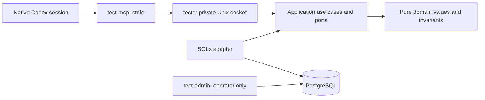

# tectd — Tect V2.1 foundation

A Rust daemon with PostgreSQL as the canonical store. A workspace is a logical
database object. Its identity comes from an authenticated tenant and an explicit
workspace key; it has no workspace directory or workspace Git worktree.

This repository implements the first V2.1 Scope. The current installed Tect plugin
continues to govern its development. Installing or replacing that plugin is a
separate operation.

The native session MCP bridge opens logical workspaces, registers Git sources and
selects worktrees per session. `get_state` does not create or update records and
never runs Git. Bootstrap and selection changes are atomic. Recovery, revocation
and measured performance acceptance are the final vertical within this Scope.

## Architecture



`tect-domain` and `tect-application` cannot depend on persistence or host adapters.
The application owns authorization order and transaction boundaries. SQLx stays in
`tect-postgres`; environment, files, processes and protocol stay in `tect-host`.
The composition binaries wire them together. Run `scripts/check-architecture.py`
to enforce the dependency allowlist, inner-crate I/O boundary and 500-line limit.

## Local configuration

Build with Rust 1.93.0 (`rust-toolchain.toml`), SQLx 0.8.6 and PostgreSQL 18.6.
Create a dedicated database and a separate login role with `NOSUPERUSER`,
`NOBYPASSRLS` and no schema ownership. The migration command grants that role only
its required table/function privileges. The daemon refuses an owner or superuser
connection. Keep admin and runtime connection URLs outside source control.

The operator runs `tect-admin migrate --runtime-role ROLE` with
`TECT_ADMIN_DATABASE_URL`, then `tect-admin enroll --out /absolute/private/host.json`.
Enrollment creates a tenant and owner, or uses an explicitly supplied existing
`--tenant UUID`. Repeated `--source-root /absolute/path` arguments declare the host's
allowed repository locations; an empty list permits zero-source bootstrap.
The generated host credential file must remain private and must not be printed.

`tectd` requires `TECT_DATABASE_URL` and `TECT_SOCKET`. The socket must be a new
absolute path inside a private directory. The daemon does not overwrite an existing
socket or manage another process. `tect-mcp` requires:

| Host setting | Meaning |
| --- | --- |
| `TECT_SOCKET` | Private daemon socket |
| `TECT_HOST_CONFIG` | Absolute, non-symlinked, mode-0600 enrollment file |
| `TECT_WORKSPACE_KEY` | Explicit logical key, 1–128 ASCII letters/digits/`.`/`_`/`-`, beginning with a letter/digit |
| `CODEX_SESSION_ID` / `CODEX_THREAD_ID` | Native host identity; both must agree when present |

These fields belong to host configuration, not tool arguments. Missing or ambiguous
native identity fails closed. A different key with the same native session is
rejected rather than silently moving the session. On macOS, resolve `<temporary-directory>` or `/var`
aliases to their canonical paths before configuring private files and sockets.

The MCP bridge uses the [MCP lifecycle](https://modelcontextprotocol.io/specification/2025-03-26/basic/lifecycle)
and [structured tool results](https://modelcontextprotocol.io/specification/2025-06-18/server/tools).
Direct execution of this bridge validates the production transport path; it does
not install a new plugin into the desktop app.

## Source tools

| Tool | Arguments | Result |
| --- | --- | --- |
| `open_workspace` | `{}` | Create or recover logical workspace/native session |
| `get_state` | `{}` | Read workspace/session and selected worktrees |
| `register_source` | `{ "path": "/absolute/source/worktree" }` | Register actual Git repository/worktree identities |
| `select_worktrees` | `{ "worktree_ids": ["UUID"] }` | Replace this session's entire selection; `[]` clears it |
| `list_sources` | `{ "limit": 25, "after": "UUID" }` | Read one ordered catalog page; `after` may be omitted |

A checkout and its linked worktrees share a repository ID. Registration does not
create or move Git worktrees. Both canonical worktree paths and Git common directories
must be within the enrolled host's allowed source roots. Sources are scoped to
workspace and host; selections belong to individual native sessions. A workspace
works with zero sources. Invalid or foreign IDs leave the old selection intact.

Selection is bounded at 100 worktrees, catalog pages at 1–100 entries, source paths
at 4096 bytes and transport frames at 8 MiB. Each page returns `next_after` when more
entries exist. Unknown arguments, including identity fields, are rejected.

## Verification

Set `TECT_TEST_ADMIN_URL`, `TECT_TEST_RUNTIME_URL` and `TECT_TEST_RUNTIME_ROLE` to
an isolated PostgreSQL database. Tests migrate that database and create fresh
tenants, hosts and workspace fixtures. Never point them at a live database.

```sh
python3 scripts/check-architecture.py
cargo fmt --all --check
cargo clippy --workspace --all-targets -- -D warnings
cargo test --workspace
```

Integration tests use real PostgreSQL and the real stdio MCP binary. Their synthetic
native IDs are fixture identities. The separate Scope proof records the inherited
native ID from the actual Codex session, without replacing it in the environment.
Local proof, remote CI, plugin installation and deployment are separate results.
