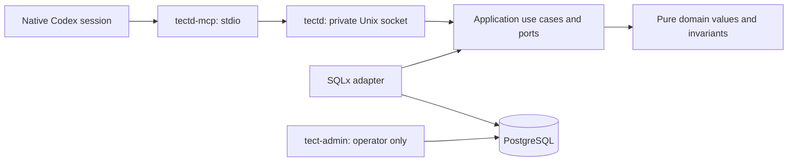

# tectd — Tect V2.1 foundation

A Rust daemon with PostgreSQL as the canonical store. A workspace is a logical
database object. Its identity comes from an authenticated tenant and an explicit
workspace key; it has no workspace directory or workspace Git worktree.

This repository implements workspace bootstrap, Program formation and initial workspace instructions in V2.1. The current installed Tect plugin
continues to govern its development. Installing or replacing that plugin is a
separate operation.

The native session MCP bridge opens logical workspaces, registers Git sources and
selects worktrees per session. `get_state` does not create or update records and
never reads files or runs Git. Bootstrap and selection changes are atomic. Recovery, revocation
and measured performance acceptance are included in the final vertical of this Scope.

## Architecture



`tect-domain` and `tect-application` cannot depend on persistence or host adapters.
The application owns authorization order and transaction boundaries. SQLx stays in
`tect-postgres`; environment, files, processes and protocol stay in `tect-host`.
The composition binaries wire them together. Run `scripts/check-architecture.py`
to enforce the dependency allowlist, inner-crate I/O boundary and 500-line limit.

## Local configuration

Build with Rust 1.93.0 (`rust-toolchain.toml`), SQLx 0.8.6 and PostgreSQL 18.6.
Create a dedicated database and a separate login role with `NOSUPERUSER`,
`NOBYPASSRLS` and no schema ownership. The migration command grants that role only
its required table/function privileges. The daemon refuses an owner or superuser
connection. Keep admin and runtime connection URLs outside source control.

The operator runs `tect-admin migrate --runtime-role ROLE` with
`TECT_ADMIN_DATABASE_URL`, then `tect-admin enroll --out /absolute/private/host.json`.
Enrollment creates a tenant and owner, or uses an explicitly supplied existing
`--tenant UUID`. Repeated `--source-root /absolute/path` arguments declare the host's
allowed repository locations; an empty list permits zero-source bootstrap.
Repeated `--setup-root /absolute/path` arguments independently grant initial AGENTS.md
publication under those physical directories. Source roots do not grant file writes.
For an existing host, `tect-admin grant-setup-root --host-id UUID --setup-root /absolute/path`
adds one canonical root without changing its identity, credential or source roots.
Concurrent additions preserve both roots; repeating an existing grant is harmless.
The generated host credential file must remain private and must not be printed.

`tectd` requires `TECT_DATABASE_URL` and `TECT_SOCKET`. The socket must be a new
absolute path inside a private directory. The daemon does not overwrite an existing
socket or manage another process. `tectd-mcp` requires:

| Host setting | Meaning |
| --- | --- |
| `TECT_SOCKET` | Private daemon socket |
| `TECT_HOST_CONFIG` | Absolute, non-symlinked, mode-0600 enrollment file |
| `TECT_WORKSPACE_KEY` | Explicit logical key, 1–128 ASCII letters/digits/`.`/`_`/`-`, beginning with a letter/digit |

These fields belong to host configuration, not tool arguments. Native identity is
read on every tool call from the Codex-generated `params._meta.threadId` UUID.
Missing, invalid or non-string identity fails before a daemon request. The bridge
never falls back to `CODEX_SESSION_ID`, `CODEX_THREAD_ID`, PID or a generated UUID.
Codex 0.153.4 strips those identity environment variables from native MCP startup;
its MCP client attaches the authoritative thread ID to tool-call metadata. A
different key with the same native session is rejected rather than moving it. On macOS, resolve `<temporary-directory>` or `/var`
aliases to their canonical paths before configuring private files and sockets.

The MCP bridge uses the [MCP lifecycle](https://modelcontextprotocol.io/specification/2025-03-26/basic/lifecycle)
and [tool results](https://modelcontextprotocol.io/specification/2025-06-18/server/tools).
Every tool result contains a fixed introductory text block and one JSON text block
with data, exact `actions` and a `recommended_action` index (or null). It omits
`structuredContent` to avoid repeating the JSON. Only the introductory prose has
the 2000-token budget; data and a requested skill body are separate.
Protocol discovery accepts standard MCP metadata, including Codex's
`tools/list` progress token; tool business arguments remain strict.
Direct execution validates the transport path. Actual bundled Codex app-server
acceptance additionally validates native MCP launch and per-call identity delivery.
These are separate from persistent installation into the desktop app.

## Independent Codex connection

The new **TectD MCP** uses plugin ID/server key `tectd` and executable/serverInfo
`tectd-mcp`. The existing Tect V1 plugin uses `tect@tect-local` and server
`tect-dynamic-materialization`. The independent source package and operator contract
are in [integrations/codex/tectd](integrations/codex/tectd/README.md).

Build `tectd-mcp`, then run `scripts/package-codex-plugin.py --binary` with that
absolute executable path and `--output` with a new output parent directory. The
packager creates `tectd/` and a binary hash receipt; it does not install a plugin,
change a marketplace, start a daemon, enroll credentials, or migrate a database.
The package forwards only the three operator configuration variables above.
The registered host credential is the trust root; native thread IDs are identifiers,
not per-session secrets.

## Source tools

| Tool | Arguments | Result |
| --- | --- | --- |
| `open_workspace` | `{}` | Create or recover logical workspace/native session |
| `get_state` | `{}` | Read workspace/session and selected worktrees |
| `register_source` | `{ "path": "/absolute/source/worktree" }` | Register actual Git repository/worktree identities |
| `select_worktrees` | `{ "worktree_ids": ["UUID"] }` | Replace this session's entire selection; `[]` clears it |
| `list_sources` | `{ "limit": 25, "after": "UUID" }` | Read one ordered catalog page; `after` may be omitted |

A checkout and its linked worktrees share a repository ID. Registration does not
create or move Git worktrees. Both canonical worktree paths and Git common directories
must be within the enrolled host's allowed source roots. Sources are scoped to
workspace and host; selections belong to individual native sessions. A workspace
works with zero sources. Invalid or foreign IDs leave the old selection intact.

Selection is bounded at 100 worktrees, catalog pages at 1–100 entries, source paths
at 4096 bytes and transport frames at 8 MiB. Each page returns `next_after` when more
entries exist. Unknown arguments, including identity fields, are rejected.

## Program formation

`get_state` lists existing Programs with unfinished work first and offers starting
a new Program last. It does not infer filesystem, knowledge-base or AGENTS state.

| Tool | Arguments | Result |
| --- | --- | --- |
| `begin_program` | `request_id`, original `input` | One database-generated Program ID in `draft` |
| `get_program` | `program_id`, optional `after_input`, `limit` | Current PRD and a page of original inputs |
| `save_program` | `program_id`, `revision`, `input_cursor`, optional patch fields and `complete` | Atomic saved revision; `complete: true` opens the same Program |
| `record_program_input` | `program_id`, `request_id`, original `input` | Durable reply or correction, ready for incorporation |
| `list_programs` | Optional `after`, `limit` | Existing Programs and exact continuation actions |
| `read_skill` | `name: "tectd-program"` | The single Program skill embedded in this build |

The PRD has six nullable, free-text fields: `name`, `intent`, `basis`, `boundaries`,
`constraints`, `success`. There is no duplicate description. `working_notes` and
`pending_question` preserve continuation, while `current_step` is backend-derived:
`compose`, `waiting_input` or `ready`. Status remains `draft` or `open`; opening
neither creates a Scope nor starts code execution.

Accept a narrative as normal input. The supplied skill guides the agent to form a
coherent PRD, label assumptions, and ask only about a material unresolved choice.
Before yielding for an answer it saves the partial draft and exact question. Once
the six concerns are coherent, all input is incorporated and no critical question
remains, it opens the same record without a mandatory final approval.

Patch omission preserves a field; explicit null clears it. An open Program retains
its six nonblank PRD fields while unresolved alternatives stay in notes. A stale
revision refuses the whole save and returns an exact reload action. Original input
is immutable and preserves exact text. Retrying the same request ID with identical
input returns the existing result; different text with that ID returns `input_conflict`.

Input pages default to entries after the saved consumed-input cursor. Read all
required pages before advancing that cursor. Read transactions use a consistent
database snapshot; writes serialize and verify revision inside their transaction.
Pages contain whole entries and may become smaller to fit the existing 8 MiB frame.
Unrepresentable writes are refused before commit, including PRD growth that would
make an older original input unreadable. Text is not silently truncated.

The host embeds `skills/tectd-program/SKILL.md`; `read_skill` is allowlisted and
authorized against the current native workspace session. It never accepts a file
path. The packaged binary therefore carries the same skill without installing
client-side PRD files or the former WorkOrder artifact lifecycle.

## Initial workspace instructions

Setup turns one company/work narrative into a durable draft and then creates
AGENTS.md directly in the current Codex task launch directory. The agent obtains
that directory from its existing task context; the user does not choose another
folder. It is independent of the logical workspace, Git sources and selected
worktrees. Two task directories in one workspace have separate setups, while a
new session in the same host/directory recovers the same draft.

| Tool | Arguments | Result |
| --- | --- | --- |
| `inspect_setup` | Optional `task_directory` | Current missing/existing/unavailable observation; omission is context unknown |
| `begin_setup` | `request_id`, exact original `input` | One durable setup in the bound directory after verified absence |
| `get_setup` | `setup_id`, optional `after_input`, `limit` | Whole draft, notes, question, original-input page and current file observation |
| `save_setup` | `setup_id`, `revision`, `input_cursor`, required `ready`, optional `content`, `working_notes`, `pending_question` | Revision-checked nullable patch |
| `record_setup_input` | `setup_id`, `revision`, `request_id`, exact original `input` | Durable reply/correction and resumed composition |
| `apply_setup` | `setup_id`, ready `revision` | Exclusive fixed-name creation or verification of matching existing bytes |
| `read_skill` | `name: "tectd-setup"` | The single setup method embedded in this build |

Native thread identity is authenticated; the agent supplies the directory and this
is not cryptographic cwd attestation. Every file operation rechecks the current
host setup grant and physical directory identity. Bindings are not permanent
capabilities. Symlink redirection, unsafe file types and another session's bound
directory are rejected. An existing file is preserved; unknown or failed
inspection never proves absence. `get_state` returns saved context only and labels
the file as unobserved, with exact recovery/inspection calls. Programs remain
available and creating a new Program remains the final action. If an old maximum
Program name cannot fit beside new context, `programs_delivery: "use_list_programs"`
explicitly directs a fresh standalone list; full names remain readable there.

The backend derives `compose`, `waiting_input`, `ready_to_apply` and `complete`.
Before asking a necessary question the agent saves the whole current draft, notes
and question. New-session recovery reads original history from `after_input: 0`;
normal reads default to the consumed cursor. Whole messages and drafts are never
silently truncated. The output guard reserves the largest accepted original beside
future drafts before committing begin/save/input changes or publishing a file.

The setup skill preserves applicable global/local instructions and scoped owner
exceptions, and shows the whole proposed file before application. It does not
introduce a routine approval ceremony. Semantic instruction preservation is an
agent responsibility, separate from database invariants.

The intended bytes and ready revision are committed before publication. The host
publishes an owned synced temporary file with an exclusive hard link, then reads
back and verifies the target. The filesystem and database are not one transaction:
if DB completion fails after creation, retry the same setup ID/ready revision to
adopt exact matching bytes. A different existing file is never overwritten. After
application, a removed or changed target produces a conflict and is not recreated.
Responses distinguish current observations from historical saved status.

## Revocation and recovery

The operator can revoke an enrolled host with
`tect-admin revoke-host --host-id UUID` or a DB session with
`tect-admin revoke-session --session-id UUID`, using `TECT_ADMIN_DATABASE_URL`.
Repeated revocation of an existing target succeeds; an unknown target returns
`not_found`. These commands are separate from MCP tools. A revoked host or session
cannot reopen its native identity. Requests admitted before host revocation may
finish; checks after its commit fail. Other sessions retain their identity and selection.

After a bridge or daemon restart, use the same host configuration, native session
and logical workspace key. `open_workspace` recovers a committed result even when
the earlier response was lost. A daemon killed before commit leaves no partial
bootstrap state. The daemon refuses to overwrite an existing Unix socket. Following
an abrupt crash, the operator must verify its owning process is dead and the socket
is the expected inode before removing that stale socket and starting the daemon.

## Verification

Set `TECT_TEST_ADMIN_URL`, `TECT_TEST_RUNTIME_URL` and `TECT_TEST_RUNTIME_ROLE` to
an isolated PostgreSQL database. Tests migrate that database and create fresh
tenants, hosts and workspace fixtures. Never point them at a live database.

```sh
python3 scripts/check-architecture.py
cargo fmt --all --check
cargo clippy --workspace --all-targets -- -D warnings
cargo test --workspace
```

Integration tests use real PostgreSQL and the real stdio MCP binary. Their native
UUIDs supplied in metadata are synthetic fixtures. The separate Scope connection
proof uses ten ephemeral threads created by the actual bundled Codex app-server and
its `mcpServer/tool/call` client, with zero model turns. The host overwrites supplied
thread metadata with the loaded thread's actual ID. Local transport, actual Codex
client acceptance, remote CI, persistent installation and deployment remain separate
proof layers; see the parent Scope result for the exact verified build. The Program
formation acceptance also uses three actual model turns: a rich narrative, a
necessary question, and a reply in a new native session. It checks the saved PRD,
exact complete original messages, loaded skill and absence of client PRD files.
Workspace-setup acceptance additionally exercises two actual task launch directories
with a fixed MCP package cwd, whole-file presentation, inherited instructions, a
saved question/new-session reply and exact publication. Ordinary recovery tests
force a DB failure after publication and lose an MCP response; both verify the
same durable intent without rewriting a conflicting file.

The ignored `legacy_program_capacity_remains_recoverable` test separately verifies
Program names accepted at the pre-setup `b6d988ef4eec91f9a90ce12ce8ac9fd75decc1a7`
boundary. Build that immutable revision in a separate checkout, then set
`TECT_LEGACY_COMMIT` to that revision, `TECT_LEGACY_DAEMON` and `TECT_LEGACY_MCP`
to its absolute binary paths, and `TECT_LEGACY_RESULT` to a new absolute JSON path.
Run `cargo test -p tect-cli --test setup_capacity legacy_program_capacity_remains_recoverable -- --ignored`.
The test uses the same isolated PostgreSQL fixture, creates the large Program through
the old API, and verifies complete-name navigation through the new API. The old
migration command is not run against the additive current schema.

For the explicit local performance profile, also set `TECT_PERFORMANCE_REPORT` to
an absolute output JSON path and run:

```sh
cargo test -p tect-cli --test performance -- --ignored --nocapture
```

This profile creates a disposable tenant with 10,000 workspaces and 100,000 sessions,
uses 100 selected worktrees per measured read session, and times actual stdio MCP
calls with ten draft Programs and ten saved setup drafts/directory bindings in the
measured workspace. Fixture setup and bridge
initialization are excluded from timings. The report records hardware, versions,
concurrency, population and percentiles for reads and workspace bootstrap.
