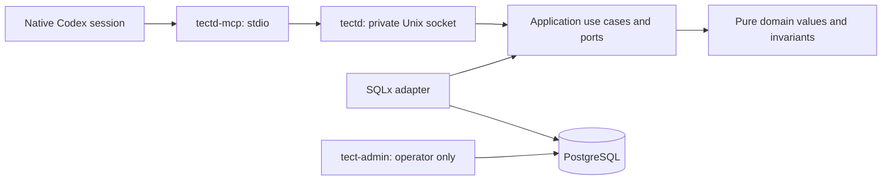

# tectd — Tect V2.1 foundation

A Rust daemon with PostgreSQL as the canonical store. A workspace is a logical
database object. Its identity comes from an authenticated tenant and an explicit
workspace key; it has no workspace directory or workspace Git worktree.

This repository implements the first V2.1 Scope. The current installed Tect plugin
continues to govern its development. Installing or replacing that plugin is a
separate operation.

The native session MCP bridge opens logical workspaces, registers Git sources and
selects worktrees per session. `get_state` does not create or update records and
never runs Git. Bootstrap and selection changes are atomic. Recovery, revocation
and measured performance acceptance are included in the final vertical of this Scope.

## Architecture



`tect-domain` and `tect-application` cannot depend on persistence or host adapters.
The application owns authorization order and transaction boundaries. SQLx stays in
`tect-postgres`; environment, files, processes and protocol stay in `tect-host`.
The composition binaries wire them together. Run `scripts/check-architecture.py`
to enforce the dependency allowlist, inner-crate I/O boundary and 500-line limit.

## Local configuration

Build with Rust 1.93.0 (`rust-toolchain.toml`), SQLx 0.8.6 and PostgreSQL 18.6.
Create a dedicated database and a separate login role with `NOSUPERUSER`,
`NOBYPASSRLS` and no schema ownership. The migration command grants that role only
its required table/function privileges. The daemon refuses an owner or superuser
connection. Keep admin and runtime connection URLs outside source control.

The operator runs `tect-admin migrate --runtime-role ROLE` with
`TECT_ADMIN_DATABASE_URL`, then `tect-admin enroll --out /absolute/private/host.json`.
Enrollment creates a tenant and owner, or uses an explicitly supplied existing
`--tenant UUID`. Repeated `--source-root /absolute/path` arguments declare the host's
allowed repository locations; an empty list permits zero-source bootstrap.
The generated host credential file must remain private and must not be printed.

`tectd` requires `TECT_DATABASE_URL` and `TECT_SOCKET`. The socket must be a new
absolute path inside a private directory. The daemon does not overwrite an existing
socket or manage another process. `tectd-mcp` requires:

| Host setting | Meaning |
| --- | --- |
| `TECT_SOCKET` | Private daemon socket |
| `TECT_HOST_CONFIG` | Absolute, non-symlinked, mode-0600 enrollment file |
| `TECT_WORKSPACE_KEY` | Explicit logical key, 1–128 ASCII letters/digits/`.`/`_`/`-`, beginning with a letter/digit |

These fields belong to host configuration, not tool arguments. Native identity is
read on every tool call from the Codex-generated `params._meta.threadId` UUID.
Missing, invalid or non-string identity fails before a daemon request. The bridge
never falls back to `CODEX_SESSION_ID`, `CODEX_THREAD_ID`, PID or a generated UUID.
Codex 0.153.4 strips those identity environment variables from native MCP startup;
its MCP client attaches the authoritative thread ID to tool-call metadata. A
different key with the same native session is rejected rather than moving it. On macOS, resolve `<temporary-directory>` or `/var`
aliases to their canonical paths before configuring private files and sockets.

The MCP bridge uses the [MCP lifecycle](https://modelcontextprotocol.io/specification/2025-03-26/basic/lifecycle)
and [structured tool results](https://modelcontextprotocol.io/specification/2025-06-18/server/tools).
Protocol discovery accepts standard MCP metadata, including Codex's
`tools/list` progress token; tool business arguments remain strict.
Direct execution validates the transport path. Actual bundled Codex app-server
acceptance additionally validates native MCP launch and per-call identity delivery.
These are separate from persistent installation into the desktop app.

## Independent Codex connection

The new **TectD MCP** uses plugin ID/server key `tectd` and executable/serverInfo
`tectd-mcp`. The existing Tect V1 plugin uses `tect@tect-local` and server
`tect-dynamic-materialization`. The independent source package and operator contract
are in [integrations/codex/tectd](integrations/codex/tectd/README.md).

Build `tectd-mcp`, then run `scripts/package-codex-plugin.py --binary` with that
absolute executable path and `--output` with a new output parent directory. The
packager creates `tectd/` and a binary hash receipt; it does not install a plugin,
change a marketplace, start a daemon, enroll credentials, or migrate a database.
The package forwards only the three operator configuration variables above.
The registered host credential is the trust root; native thread IDs are identifiers,
not per-session secrets.

## Source tools

| Tool | Arguments | Result |
| --- | --- | --- |
| `open_workspace` | `{}` | Create or recover logical workspace/native session |
| `get_state` | `{}` | Read workspace/session and selected worktrees |
| `register_source` | `{ "path": "/absolute/source/worktree" }` | Register actual Git repository/worktree identities |
| `select_worktrees` | `{ "worktree_ids": ["UUID"] }` | Replace this session's entire selection; `[]` clears it |
| `list_sources` | `{ "limit": 25, "after": "UUID" }` | Read one ordered catalog page; `after` may be omitted |

A checkout and its linked worktrees share a repository ID. Registration does not
create or move Git worktrees. Both canonical worktree paths and Git common directories
must be within the enrolled host's allowed source roots. Sources are scoped to
workspace and host; selections belong to individual native sessions. A workspace
works with zero sources. Invalid or foreign IDs leave the old selection intact.

Selection is bounded at 100 worktrees, catalog pages at 1–100 entries, source paths
at 4096 bytes and transport frames at 8 MiB. Each page returns `next_after` when more
entries exist. Unknown arguments, including identity fields, are rejected.

## Revocation and recovery

The operator can revoke an enrolled host with
`tect-admin revoke-host --host-id UUID` or a DB session with
`tect-admin revoke-session --session-id UUID`, using `TECT_ADMIN_DATABASE_URL`.
Repeated revocation of an existing target succeeds; an unknown target returns
`not_found`. These commands are separate from MCP tools. A revoked host or session
cannot reopen its native identity. Requests admitted before host revocation may
finish; checks after its commit fail. Other sessions retain their identity and selection.

After a bridge or daemon restart, use the same host configuration, native session
and logical workspace key. `open_workspace` recovers a committed result even when
the earlier response was lost. A daemon killed before commit leaves no partial
bootstrap state. The daemon refuses to overwrite an existing Unix socket. Following
an abrupt crash, the operator must verify its owning process is dead and the socket
is the expected inode before removing that stale socket and starting the daemon.

## Verification

Set `TECT_TEST_ADMIN_URL`, `TECT_TEST_RUNTIME_URL` and `TECT_TEST_RUNTIME_ROLE` to
an isolated PostgreSQL database. Tests migrate that database and create fresh
tenants, hosts and workspace fixtures. Never point them at a live database.

```sh
python3 scripts/check-architecture.py
cargo fmt --all --check
cargo clippy --workspace --all-targets -- -D warnings
cargo test --workspace
```

Integration tests use real PostgreSQL and the real stdio MCP binary. Their native
UUIDs supplied in metadata are synthetic fixtures. The separate Scope connection
proof uses ten ephemeral threads created by the actual bundled Codex app-server and
its `mcpServer/tool/call` client, with zero model turns. The host overwrites supplied
thread metadata with the loaded thread's actual ID. Local transport, actual Codex
client acceptance, remote CI, persistent installation and deployment remain separate
proof layers; see the parent Scope result for the exact verified build.

For the explicit local performance profile, also set `TECT_PERFORMANCE_REPORT` to
an absolute output JSON path and run:

```sh
cargo test -p tect-cli --test performance -- --ignored --nocapture
```

This profile creates a disposable tenant with 10,000 workspaces and 100,000 sessions,
uses 100 selected worktrees per measured read session, and times actual stdio MCP
calls. Fixture setup is excluded from warm timings. The report separates warm calls
from bridge startup and records hardware, versions, concurrency and percentiles.
